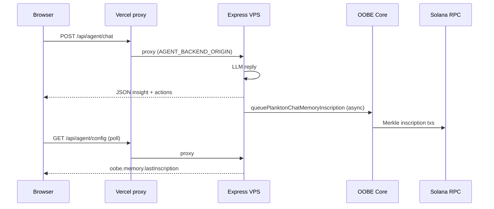

# OOBE Protocol (on-chain agent memory)

This guide describes how **Plankton’s Cyber Ocean** integrates **[OOBE Protocol](https://oobe-protocol.gitbook.io/oobe-protocol)** so each successful **Agent Chat** reply can be **inscribed on Solana** as verifiable on-chain memory—not only stored on Plankton servers.

It complements **[Integrations](./INTEGRATIONS.md)**, **[Configuration](./CONFIGURATION.md)**, and **[Deployment](./DEPLOYMENT.md)**. **Never** commit `OOBE_AGENT_PRIVATE_KEY`, OpenAI keys, or `.env` files. See **[SECURITY.md](../SECURITY.md)**.

---

## What operators should know

| Topic | Detail |
|--------|--------|
| **Where it runs** | **VPS Express only** (`backend/`). OOBE Core and `oobe-protocol` npm SDK load on the server; secrets never ship to the browser. |
| **Who pays on-chain** | The **OOBE agent wallet** (`OOBE_AGENT_PRIVATE_KEY`) pays Solana transaction fees for Merkle inscriptions (typically **two signatures** per chat turn). |
| **Who pays the LLM** | Plankton’s normal agent LLM keys (Claude/Groq/OpenAI) are separate from OOBE. **OOBE Core** additionally requires **`OOBE_OPENAI_API_KEY`** or **`OPENAI_API_KEY`** when phase 2 memory is enabled. |
| **User-visible UI** | Banner on **`/agent-chat`** and the Dashboard inline assistant: **OOBE on-chain memory**, pending spinner, **Memory saved on-chain**, Solscan **Tx** links. |
| **Failure behavior** | Inscription runs **after** the HTTP chat response is sent (`fire-and-forget`). Chat still succeeds if on-chain write fails; the UI may show **Memory not confirmed**. |

---

## Phases

### Phase 1 — Readiness (no on-chain writes)

Health and RPC checks without loading full on-chain inscription flow for every message.

| Endpoint | Purpose |
|----------|---------|
| **`GET /api/oobe/status`** | Config flags, missing env vars, `memory` block (enabled / coreReady / lastInscription) |
| **`GET /api/oobe/probe`** | Same as status plus **`probe`**: Solana `getBalance` for the agent wallet via `SOLANA_RPC_URL` |

Also exposed on **`GET /api/agent/config`** under the **`oobe`** object (used by the frontend).

**Phase 1 readiness** accepts any Plankton LLM key for the `keys.llm` flag: `OOBE_OPENAI_API_KEY`, `OPENAI_API_KEY`, `ANTHROPIC_API_KEY`, or `GROQ_API_KEY`. **Phase 2 Core** still requires an **OpenAI** key when memory is enabled.

### Phase 2 — On-chain memory (opt-in)

When **`OOBE_MEMORY_ENABLED=1`**:

1. **`POST /api/agent/chat`** returns the normal LLM JSON, then **queues** an async inscription with the user message + agent `insight`.
2. **`POST /api/oobe/memory`** manually inscribes a test payload (costs SOL; for operators).
3. **`GET /api/agent/config`** → `oobe.memory.lastInscription` updates after each successful write (timestamp + merkle root + signatures).

Implementation: `backend/src/lib/oobeMemory.ts`, routes in `backend/src/routes/oobe.ts`, hook in `backend/src/routes/agent.ts`.

---

## Architecture



| Layer | Files | Role |
|--------|--------|------|
| **Frontend** | `frontend/src/lib/oobe-client.ts`, `useOobeMemory.ts`, `OobeMemoryPanel.tsx` | Parse `oobe` from config; poll after chat; show banner + Solscan links |
| **Agent config** | `backend/src/routes/agent.ts` | `oobe: { ...getOobeConfigStatus(), memory }` |
| **OOBE routes** | `backend/src/routes/oobe.ts` | `/api/oobe/status`, `/probe`, `/memory` |
| **Core** | `backend/src/lib/oobe.ts`, `oobeMemory.ts` | Env checks, `OobeCore` via `createRequire("oobe-protocol")` |

The browser calls **`getAgentApiBase()`** (same origin or `VITE_AGENT_API_URL`). Production must reach the **VPS** where OOBE env vars live—usually **`AGENT_BACKEND_ORIGIN`** on Vercel.

---

## Configuration (`backend/.env`)

Copy from [`backend/.env.example`](../backend/.env.example).

| Variable | Phase | Required | Purpose |
|----------|-------|----------|---------|
| **`OOBE_AGENT_PRIVATE_KEY`** | 1+2 | Yes | Dedicated agent wallet: JSON byte array `[1,2,...]` or base58 secret. **Highly sensitive.** |
| **`SOLANA_RPC_URL`** | 1+2 | Yes | Mainnet RPC for balance probe and inscription. Prefer a reliable provider (e.g. **Helius**). Public/free RPCs often **403** on `sendTransaction`. |
| **`OOBE_OPENAI_API_KEY`** or **`OPENAI_API_KEY`** | 2 | Yes for memory | OOBE Core OpenAI module. Phase 1 `keys.openAi` uses the same. |
| **`OOBE_MEMORY_ENABLED`** | 2 | Yes for memory | `1`, `true`, or `yes` to enable on-chain writes after chat. |
| **`OOBE_AGENT_PUBKEY`** | — | No | Override displayed pubkey if not derived from secret. |
| **`OOBE_KEY`** | — | No | Optional OOBE platform key. |
| **`OOBE_MERKLE_DB_SEED`**, **`OOBE_MERKLE_ROOT_SEED`** | — | No | Merkle seeds (defaults exist in code). |
| **`OOBE_PRISMA_DB_URL`** | — | No | **Off by default.** Set only if you run OOBE’s Prisma/SQLite DB locally. Without it, Plankton uses on-chain Merkle only (recommended on VPS). |
| **`OOBE_ENABLED`** | — | No | Set `0` to report OOBE disabled in status even when keys exist (does **not** replace `OOBE_MEMORY_ENABLED`). |
| **`ANTHROPIC_API_KEY`** / **`GROQ_API_KEY`** | 1 | No | Count toward phase-1 `keys.llm` only; **not** sufficient alone for OOBE Core in phase 2. |

**Example (names only—use real values on the server):**

```env
SOLANA_RPC_URL=https://mainnet.helius-rpc.com/?api-key=YOUR_KEY
OOBE_AGENT_PRIVATE_KEY=...
OOBE_OPENAI_API_KEY=sk-...
OOBE_MEMORY_ENABLED=1
```

Restart after changes:

```bash
cd /path/to/plankton-s-cyber-ocean/backend && npm run build && pm2 restart plankton-api --update-env
```

Fund the agent wallet with **SOL** for recurring inscription fees.

---

## API reference (VPS)

Base URL: your Express origin (e.g. `https://api.example.com` or direct VPS port behind TLS).

### `GET /api/oobe/status`

Returns configuration and memory snapshot.

```json
{
  "configured": true,
  "enabled": true,
  "docs": "https://oobe-protocol.gitbook.io/oobe-protocol",
  "agentPubkey": "7hsm...",
  "memory": {
    "enabled": true,
    "coreReady": true,
    "lastInscription": {
      "ok": true,
      "merkleRoot": "f7723f85...",
      "signatures": ["...", "..."],
      "at": "2026-05-18T12:00:00.000Z"
    }
  }
}
```

### `GET /api/oobe/probe`

Adds **`probe.ok`** and balance when configured. HTTP **502** if probe fails.

### `POST /api/oobe/memory`

Manual test inscription.

**Body:**

```json
{
  "message": "user question",
  "insight": "agent answer summary",
  "wallet": "optional-user-wallet-base58"
}
```

**Success (200):** `ok: true`, `merkleRoot`, `signatures[]`, `at`.  
**Errors:** **503** if `OOBE_MEMORY_ENABLED` is off; **502** if Core or RPC fails.

### `GET /api/agent/config` → `oobe`

Same status fields as above; the **frontend polls** `memory.lastInscription.at` after each chat to drive the UI.

---

## What users see (frontend)

When `oobe.memory.enabled === true` (from config on the agent API origin):

1. **Banner** under the chat header: *OOBE on-chain memory*, **Core ready** / **Core starting**, agent wallet link (Solscan).
2. After a **successful VPS LLM** reply (not local-only flows like “Check Balance”): *Writing memory on-chain…*
3. Then **Memory saved on-chain** with merkle **root** and up to two **Tx** buttons (`https://solscan.io/tx/...`).

Routes: **`/agent-chat`** (`AgentChatPage`) and Dashboard workspace chat (`AgentChatInlinePreview`).

If the banner never appears, the production site is not receiving `oobe.memory.enabled: true` from **`GET /api/agent/config`** (wrong proxy or memory disabled on VPS).

---

## Verification checklist

Run against the **same origin** the browser uses for agent APIs.

### 1. Status and Core

```bash
curl -s "https://YOUR_API_ORIGIN/api/oobe/status" | jq '.memory'
```

Expect: `"enabled": true`, `"coreReady": true` (may take a few seconds after first request).

### 2. RPC and wallet

```bash
curl -s "https://YOUR_API_ORIGIN/api/oobe/probe" | jq '.probe'
```

Expect: `"ok": true` and a lamports/balance value.

### 3. Manual inscription

```bash
curl -s -X POST "https://YOUR_API_ORIGIN/api/oobe/memory" \
  -H "Content-Type: application/json" \
  -d '{"message":"docs test","insight":"OOBE manual inscription test"}' | jq
```

Expect: `"ok": true` and two signatures. Open one on [Solscan](https://solscan.io/).

### 4. Agent config (UI contract)

```bash
curl -s "https://YOUR_API_ORIGIN/api/agent/config" | jq '.oobe.memory'
```

### 5. End-to-end UI

1. Deploy frontend with OOBE panel (commit `feat(frontend): show OOBE on-chain memory status in agent chat UI`).
2. Open **`/agent-chat`**, connect wallet, send a normal agent question.
3. Confirm banner → pending → **Memory saved on-chain** + Tx links.

### 6. Server logs

```bash
grep '\[OOBE\]' ~/.pm2/logs/plankton-api-out.log | tail -20
```

Healthy lines include:

- `OOBE CORE - started successfully!` (from SDK)
- `[OOBE] memory inscribed`

---

## Troubleshooting

| Symptom | What to check |
|---------|----------------|
| No OOBE banner in UI | `curl .../api/agent/config` from **production** domain; `oobe.memory.enabled` must be `true`. Set **`AGENT_BACKEND_ORIGIN`** on Vercel to the VPS. |
| **Core starting** forever | `OOBE_OPENAI_API_KEY` / `OPENAI_API_KEY` set and valid; agent wallet has SOL; VPS logs for `[OOBE] core init failed`. |
| **Memory not confirmed** after chat | RPC 403 on send—use **Helius** (or paid RPC) in `SOLANA_RPC_URL`; low SOL on agent wallet; wait and click **Refresh status**. |
| `POST /api/oobe/memory` → 503 | `OOBE_MEMORY_ENABLED=1` missing. |
| Probe fails, memory works (or vice versa) | Same `SOLANA_RPC_URL`; probe uses `getBalance`, inscription uses `sendTransaction`. |
| Prisma / SQLite errors in logs | Remove `url_prisma_db` unless you intentionally set **`OOBE_PRISMA_DB_URL`**. Default Plankton build disables Prisma for OOBE. |
| Chat works locally but not OOBE on prod | Chat might hit Vercel stub while config on VPS differs—align **one** agent API origin. |
| Only phase 1, no inscriptions | `OOBE_MEMORY_ENABLED` not set; or chat not reaching VPS hook (non-LLM quick actions skip queue). |

---

## Security and operations

1. **Dedicated wallet**: Use a hot wallet only for OOBE inscriptions—not your treasury or user funds.
2. **Key rotation**: If `OOBE_AGENT_PRIVATE_KEY` leaks, rotate immediately and fund the new wallet.
3. **RPC**: Do not rely on anonymous public RPCs for production inscriptions.
4. **Cost**: Each inscribed chat turn consumes SOL; monitor balance and log volume.
5. **Data on-chain**: Payloads are compact (`message` truncated, `insight` truncated); assume inscriptions are **public** on Solana.

---

## Related documentation

| Doc | Content |
|-----|---------|
| [Integrations](./INTEGRATIONS.md) | OOBE row in the integrations table |
| [Configuration](./CONFIGURATION.md) | VPS env layout and agent chat |
| [Deployment](./DEPLOYMENT.md) | Vercel + VPS hybrid, `AGENT_BACKEND_ORIGIN` |
| [Backend API](./backend-api.md) | Agent routes overview |
| [LLM providers](./llm-providers.md) | Plankton Agent models (separate from OOBE Core OpenAI) |
| [OOBE Protocol (upstream)](https://oobe-protocol.gitbook.io/oobe-protocol) | Official OOBE docs |
